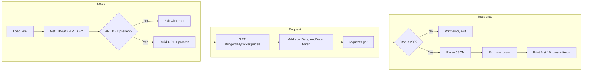
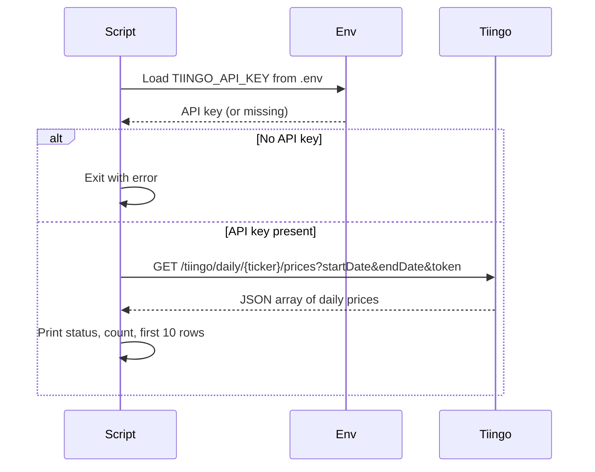

# README: Lab — Develop a Meaningful API Query

Documentation for the script **`lab_develop_a_meaningful_project_API_query`**, which queries the **Tiingo Financial Data API** for daily stock price time series.

---

## Overview

This Python script fetches **daily stock price data** from the Tiingo API for a given ticker and date range. It is intended for analysis or reporting (e.g., building a reporter application) and returns multiple rows of time-series data (open, high, low, close, volume, adjusted close) per day.

- **API:** Tiingo Financial Data API  
- **Purpose:** Retrieve daily stock price time series for a ticker over a specified period.  
- **Output:** JSON array of daily price records; the script prints status, row count, and the first 10 rows (or all if fewer than 10).

---

## API Endpoint and Parameters

| Item | Value |
|------|--------|
| **Base URL** | `https://api.tiingo.com` |
| **Endpoint** | `GET /tiingo/daily/{ticker}/prices` |
| **Authentication** | Query parameter `token` (API key from `.env`) |

### Path Parameter

| Parameter | Type | Description |
|-----------|------|-------------|
| `ticker` | string | Stock ticker symbol (e.g., `AAPL`, `MSFT`). Set in script; default `AAPL`. |

### Query Parameters

| Parameter | Type | Required | Description |
|-----------|------|----------|-------------|
| `startDate` | string (YYYY-MM-DD) | No | Start of date range. Script default: `2024-01-01`. |
| `endDate` | string (YYYY-MM-DD) | No | End of date range. Script default: `2024-01-31`. |
| `token` | string | **Yes** | Tiingo API key (loaded from `TIINGO_API_KEY` in `.env`). |

### Request Headers

- `Accept: application/json`

---

## Data Structure

The API returns a **JSON array** of daily price objects. Each element has the following fields:

| Field | Type | Description |
|-------|------|-------------|
| `date` | string (ISO date) | Trading date. |
| `open` | number | Opening price. |
| `high` | number | High price. |
| `low` | number | Low price. |
| `close` | number | Closing price. |
| `volume` | integer | Trading volume. |
| `adjClose` | number | Adjusted closing price. |

**Example row (conceptual):**

```json
{
  "date": "2024-01-02",
  "open": 185.56,
  "high": 186.86,
  "low": 183.72,
  "close": 185.64,
  "volume": 102501234,
  "adjClose": 185.64
}
```

The script prints the first 10 rows (or all if fewer) and lists all available keys from the first record.

---

## Flow Diagram (Mermaid)



**High-level sequence:**



---

## Usage Instructions

### Prerequisites

- **Python 3** with `requests` and `python-dotenv` installed:
  - `pip install requests python-dotenv`
- A **Tiingo API key**. Sign up at [Tiingo](https://www.tiingo.com/account/api/token) and add the key to a `.env` file in the same directory as the script.

### Environment Setup

1. Create a `.env` file in `01_query_api/` (or the directory from which you run the script):
   ```bash
   TIINGO_API_KEY=your_api_key_here
   ```
2. Do not commit `.env` to version control.

### Running the Script

From the project root or from `01_query_api/`:

```bash
# From repo root (adjust path if your cwd is different)
python 01_query_api/lab_develop_a_meaningful_project_API_query
```

Or from inside `01_query_api/`:

```bash
cd 01_query_api
python lab_develop_a_meaningful_project_API_query
```

### Customizing the Query

Edit the script to change:

- **Ticker:** Set `ticker = "AAPL"` to another symbol (e.g., `"MSFT"`, `"GOOGL"`).
- **Date range:** Set `params["startDate"]` and `params["endDate"]` to desired `YYYY-MM-DD` values.

### Expected Output

- “Querying Tiingo API…” and the ticker.
- HTTP status code and final request URL.
- Number of rows returned.
- A block showing the first 10 rows (or all rows if fewer than 10) with `date`, `open`, `high`, `low`, `close`, `volume`, `adjClose`.
- A line listing all available fields from the first record.

If the API key is missing or the request fails (non-200), the script prints an error and exits.

---

## Related Lab Materials

- Lab instructions: [LAB_your_good_api_query.md](LAB_your_good_api_query.md)  
- Script: `lab_develop_a_meaningful_project_API_query` (no file extension; run with Python as above)
